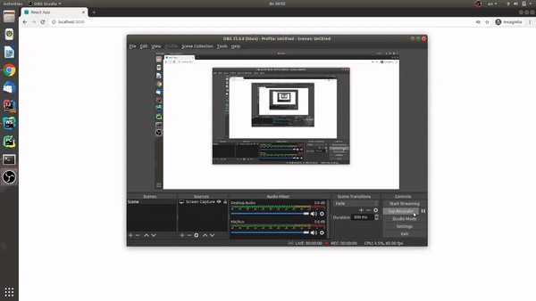

Задание: Сделайте, пожалуйста, веб приложение, на выбранном вами языке, при открытии должно показать кнопку «авторизоваться» по нажатию делает oauth авторизацию ВКонтакте, и показывает имя авторизованного пользователя и 5 любых друзей пользователя. При последующих запусках/заходах на страницу сразу показывает всю информацию т.к. уже понимает, что авторизовано и авторизация запоминается. Бекенд,  если потребуется, на любой технологии на ваш выбор. 

## Реализация

Реализовано на ReactJs без использования backend'a. При редиректе для на vk.oauth указан response_type=token так как запрос(redirect т.к get запрос нельзя отравить в связи с тем, что на сервере не указан CORS заголовок в header) отправляется с frontend'a.
При нажатии кнопки login происходит redirect на сгенерированную ссылку vk.oauth, которая затем редиректит на главную страницу
При загрузке страницы происходит проверка есть ли в localStorage accees token,если его нет или он обновлен то токен берется из url'a и добавляется в localStorage.
С помощью полученного токена следует запрос к vk.api, используя jsonp, запрос возвращает нужную информацию
## Используемые модули

##### axios
##### fetch-jsonp
##### history
##### node-sass

## Demo gif

